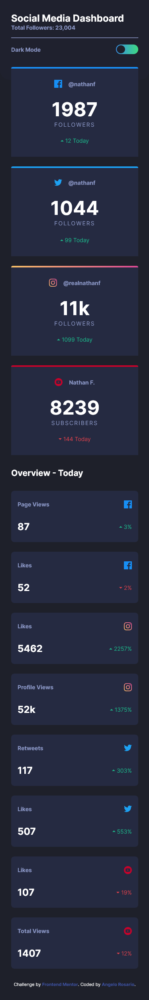
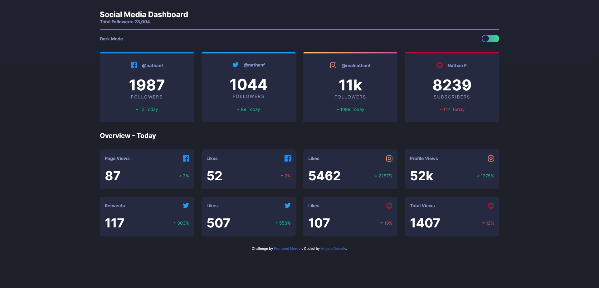

# Frontend Mentor - Social media dashboard with theme switcher solution

This is a solution to the [Social media dashboard with theme switcher challenge on Frontend Mentor](https://www.frontendmentor.io/challenges/social-media-dashboard-with-theme-switcher-6oY8ozp_H). Frontend Mentor challenges help you improve your coding skills by building realistic projects. 

## Table of contents

- [Overview](#overview)
  - [The challenge](#the-challenge)
  - [Screenshot](#screenshot)
  - [Links](#links)
- [My process](#my-process)
  - [Built with](#built-with)
  - [What I learned](#what-i-learned)
  - [Continued development](#continued-development)
- [Author](#author)

## Overview

### The challenge

Users should be able to:

- View the optimal layout for the site depending on their device's screen size
- See hover states for all interactive elements on the page
- Toggle color theme to their preference

### Screenshot




### Links

- Solution URL: [GitHub](https://your-solution-url.com)
- Live Site URL: [Netlify](https://your-live-site-url.com)

## My process

I wanted to spend more time figuring out whether some elements needed containers or not, as well as how to easily implement grid. So after that, I worked on the custom properties, then html, javascript, and finishing up with all the styling.

### Built with

- Semantic HTML5 markup
- CSS custom properties
- Flexbox
- CSS Grid
- Mobile-first workflow
- [SASS](https://sass-lang.com/) - CSS Preprocessor

### What I learned

The biggest thing I learned in this project was how to implement themes. In my SASS architecture, there is a specified file for themes, inside it includes a set for light and dark:

```css
.dark-theme {
  --clr-primary-bg: #{$clr-dark-bg};
  --clr-body: #{$clr-dark-text};
  --clr-toggle-bg: #{$gradient-theme-dark};
  --clr-circle: #{$clr-dark-bg};
  --clr-headers: #{$clr-dark-headers};
  --clr-topbg: #{$clr-dark-topbg};
  --clr-card-bg: #{$clr-dark-cardbg};
  --clr-hover-opacity: #{$clr-dark-hover};
}

.light-theme {
  --clr-primary-bg: #{$clr-light-bg};
  --clr-body: #{$clr-light-text};
  --clr-toggle-bg: #{$clr-theme-light};
  --clr-circle: #{$clr-light-bg};
  --clr-headers: #{$clr-light-headers};
  --clr-topbg: #{$clr-light-topbg};
  --clr-card-bg: #{$clr-light-cardbg};
  --clr-hover-opacity: #{$clr-light-hover};
}
```
 Then we can hook these up to our other css properties like so:

 ```css
 body {
  background-color: var(--clr-primary-bg);
  ...
}
```

In our HTML, we initially gave our body the class of ```dark-theme```. This will change using javascript when the toggle is clicked on the page.

```js
const body = document.body;
const toggleSwitch = document.querySelector('.toggle-switch');
const circle = document.querySelector('.circle');

toggleSwitch.addEventListener('click', () => {
  toggleSwitch.classList.toggle('active');
  circle.classList.toggle('active');
  body.classList.toggle('light-theme');
  body.classList.toggle('dark-theme');
})
```

The toggleSwitch and circle variables are going to have an active class on them which changes their color, transform, etc.

### Continued development

I am fairly happy with the way I was able to implement grid for this project. Although, if there is a better way to implicitly declare it, then I would definitely like to learn it.

## Author

- Frontend Mentor - [@Sengsith](https://www.frontendmentor.io/profile/Sengsith)
